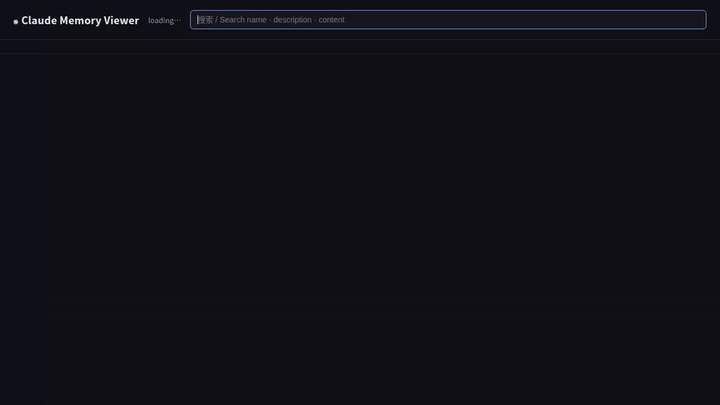
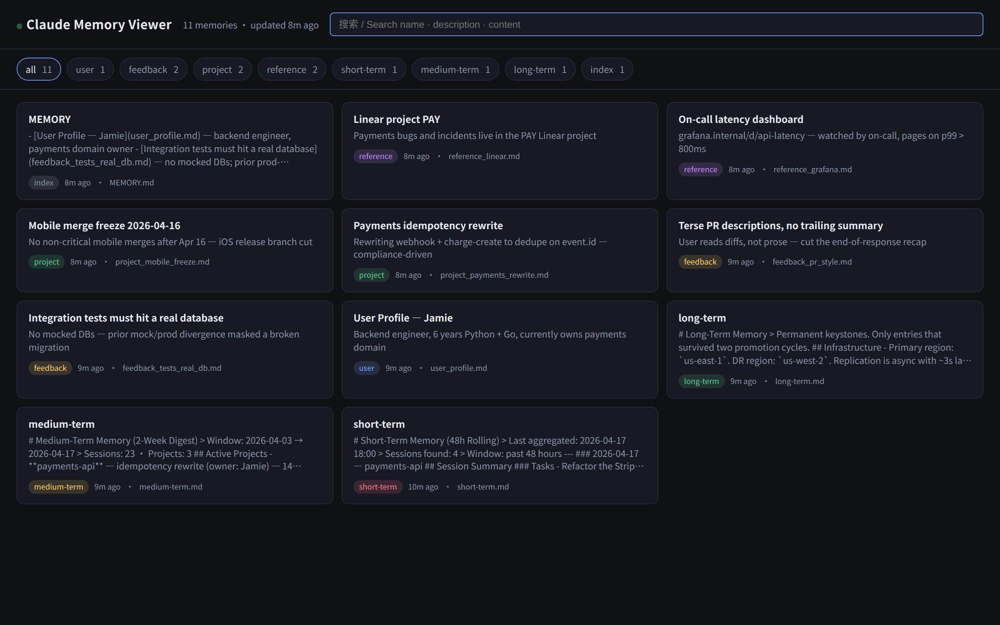

# claude-3layer-memory

<!--
Repository URL: https://github.com/nicksung369/claude-3layer-memory
-->

> **Persistent memory for Claude Code, OpenClaw, and Hermes — zero AI cost, local-first, with a live web dashboard.**

Short · medium · long-term tiering driven by `bash` + `cron`. No vector DB, no API calls, no lock-in. One install, three agent editions, one dashboard.



## Quick Start

```bash
git clone https://github.com/nicksung369/claude-3layer-memory.git
cd claude-3layer-memory
./install.sh --with-all      # scripts + cron + web viewer (localhost:37777)
./install.sh --status        # health check anytime
```

Open **http://127.0.0.1:37777** to see your memory as it lands.

**Using OpenClaw?** → [`openclaw/`](openclaw/)  &nbsp;·&nbsp;  **Using Hermes Agent?** → [`hermes/`](hermes/)

## Why this exists

Every Claude Code session starts fresh. You re-brief context, re-explain decisions, re-paste file paths. Over weeks, that's hours of wasted typing and a lot of "wait, what did we decide about X last week?"

claude-3layer-memory gives your agent a real memory across sessions — **without** sending data to a third-party vector store, running a heavyweight daemon, or paying for embeddings.

## Architecture

```
┌──────────────┐  every 6h   ┌──────────────┐
│ Session Data  │ ──────────> │  Short-Term   │
│ (*.tmp files) │             │  (48h rolling)│
└──────────────┘             └──────┬───────┘
                                    │ every 48h (text extraction)
                                    v
                             ┌──────────────┐
                             │ Medium-Term   │
                             │ (2-week digest)│
                             └──────┬───────┘
                                    │ every 2 weeks (keyword extraction)
                                    v
                             ┌──────────────┐
                             │  Long-Term    │
                             │ (permanent)   │
                             └──────────────┘
```

### Three Layers

| Layer | Window | Updates | Contains |
|-------|--------|---------|----------|
| **Short-term** | 48 hours | Every 6h (cron) | Raw session summaries from all projects |
| **Medium-term** | 2 weeks | Every 48h (cron) | Extracted tasks, files modified, active projects |
| **Long-term** | Permanent | Every 2 weeks (cron) | Key decisions, infrastructure, patterns |

### Zero Dependencies

No AI API calls needed. All promotion is done via pure text/keyword extraction (`grep`, `sed`). Just bash + cron.

## Installation

### Quick Start

```bash
git clone https://github.com/nicksung369/claude-3layer-memory.git
cd claude-3layer-memory
./install.sh --with-cron
```

### Manual Install

```bash
# Without cron (prints cron commands for you to add manually)
./install.sh
```

### Web Viewer (optional)

A single-file, stdlib-only dashboard at `http://127.0.0.1:37777` that lists every
tier (short/medium/long + auto-memory), supports search, type filtering, and
live-refreshes every 3 seconds so you can see memories land as they are written.



> The screenshot is from `viewer/demo/` — a fictional Jamie/payments-team dataset
> bundled with the repo. You can preview the UI against it any time:
> ```bash
> python3 viewer/server.py --dir viewer/demo
> ```

**Install:**

```bash
./install.sh --with-viewer
```

This also writes an autostart unit for your platform:
- **macOS** — `~/Library/LaunchAgents/com.claude-3layer-memory.viewer.plist`
  ```bash
  launchctl load ~/Library/LaunchAgents/com.claude-3layer-memory.viewer.plist
  ```
- **Linux** — `~/.config/systemd/user/claude-memory-viewer.service`
  ```bash
  systemctl --user daemon-reload
  systemctl --user enable --now claude-memory-viewer.service
  ```

Then open `http://127.0.0.1:37777`.

Zero extra dependencies — no Node, no React build, no vector DB. Useful for:
- Debugging "why isn't it remembering X?" — see if capture is working.
- Trusting the system — watch memories actually accumulate.
- Quick search across tiers without `grep`-ing the filesystem.

#### Optional: UI controls

Pass `--enable-controls` to expose three buttons in the header
(`aggregate-short-term`, `promote → medium`, `promote → long`) that shell out
to the installed scripts in `~/.claude/scripts/memory/`.

```bash
python3 ~/.claude/scripts/memory-viewer/server.py --enable-controls
```

Safety rails:
- Off by default.
- Refuses to start with controls on if bound to a non-loopback host.
- Action → script map is fixed; no user-supplied paths reach `subprocess`.
- 60s per-script timeout; stdout/stderr returned in the JSON response.

### Hook Setup

To load memories on session start, you need a SessionStart hook. Two options:

**Option A: Standalone hook** (if you don't have an existing session-start hook):
```bash
cp hooks/session-start-standalone.js ~/.claude/scripts/hooks/session-start.js
```

Add to `~/.claude/settings.json`:
```json
{
  "hooks": {
    "SessionStart": [{
      "type": "command",
      "command": "node ~/.claude/scripts/hooks/session-start.js"
    }]
  }
}
```

**Option B: Patch existing hook** (if you already have a session-start hook):
```js
const { loadTieredMemory } = require('./session-start-patch');
const claudeDir = path.join(process.env.HOME, '.claude');
const memoryParts = loadTieredMemory(claudeDir);
additionalContextParts.push(...memoryParts);
```

## How It Works

### Session Data Collection

Claude Code's Stop hook writes session summaries to `~/.claude/session-data/`. Each file contains:
- User messages (tasks requested)
- Tools used
- Files modified
- Project and worktree metadata

> **Note:** Session data collection requires a Stop hook. If you're using [ECC (Everything Claude Code)](https://github.com/anthropics/ecc), this is already set up.

### Cron Schedule

| Schedule | Script | Action |
|----------|--------|--------|
| `0 */6 * * *` | `aggregate-short-term.sh` | Collect last 48h of sessions |
| `0 3 * * 1,4` | `promote-to-medium.sh` | Extract short -> medium |
| `0 4 1,15 * *` | `promote-to-long.sh` | Extract medium -> long |

### Memory Loading

On each new session, the SessionStart hook loads memories in order:
1. **Long-term** (up to 150 lines) — permanent knowledge
2. **Medium-term** (up to 100 lines) — recent 2-week digest
3. **Short-term** (up to 200 lines) — last 48h raw summaries

### Archiving

When files exceed size limits, old content is automatically archived to `~/.claude/memory/global/archive/` before pruning.

## File Structure

```
~/.claude/
├── memory/global/
│   ├── short-term.md              # 48h rolling memory
│   ├── medium-term.md             # 2-week digest
│   ├── long-term.md               # Permanent knowledge
│   ├── archive/                   # Archived old entries
│   └── cron.log                   # Automation logs
└── scripts/memory/
    ├── aggregate-short-term.sh    # Session -> short-term
    ├── promote-to-medium.sh       # Short -> medium
    └── promote-to-long.sh         # Medium -> long
```

## Uninstall

```bash
./install.sh --uninstall
```

This removes scripts and cron jobs but preserves your memory data. To fully clean up:

```bash
rm -rf ~/.claude/memory/global
```

## Editions

Three adaptations of the same three-layer pattern, picking up the short-term
source that each agent already produces:

| Edition | Short-term source | Long-term target | Writes to agent's curated file? |
|---------|-------------------|------------------|---------------------------------|
| **Claude Code** _(root of this repo)_ | session `.tmp` files | `long-term.md` | yes |
| **[OpenClaw](openclaw/)** | daily `YYYY-MM-DD.md` in workspace | appended to `MEMORY.md` | yes (append) |
| **[Hermes Agent](hermes/)** | `state.db` (SQLite + FTS5) | `_promotions.md` review queue | **no** — respects 2,200-char budget |

```bash
cd openclaw && ./install.sh --with-cron     # OpenClaw users
cd hermes   && ./install.sh --with-cron     # Hermes users
```

## Requirements

- bash, cron
- Claude Code CLI (for the SessionStart hook; root edition)
- For OpenClaw edition: OpenClaw agent with workspace access
- For Hermes edition: Hermes Agent installed (`~/.hermes/`) and the `sqlite3` CLI

## License

MIT

---

# claude-3layer-memory (中文)

> **为 Claude Code、OpenClaw 和 Hermes 提供持久化记忆 —— 零 AI 费用、完全本地、自带实时网页看板。**

短期 · 中期 · 长期三层记忆，全靠 `bash` + `cron`。不依赖向量库、不调 API、不锁用户。一次安装，三个 agent 版本，一个看板。


## 快速开始

```bash
git clone https://github.com/nicksung369/claude-3layer-memory.git
cd claude-3layer-memory
./install.sh --with-all      # 脚本 + cron + 网页看板 (localhost:37777)
./install.sh --status        # 随时体检
```

打开 **http://127.0.0.1:37777** 即可看到记忆实时落盘。

**用 OpenClaw？** → [`openclaw/`](openclaw/)  &nbsp;·&nbsp;  **用 Hermes Agent？** → [`hermes/`](hermes/)

## 为什么做这个

每次 Claude Code 会话都从零开始。你要反复交代上下文、重新解释决策、重新粘贴文件路径。几周下来，这是好几个小时的无效打字 + 大量"等等，上周 X 这事我们是怎么定的？"。

claude-3layer-memory 给你的 agent 一份真正跨会话的记忆 —— **不用**把数据送去第三方向量库，**不用**跑重型 daemon，**不用**为 embedding 付费。

## 架构

```
┌──────────────┐  每6小时    ┌──────────────┐
│ 会话数据       │ ──────────> │   短期记忆     │
│ (*.tmp 文件)  │             │ (48小时滚动)   │
└──────────────┘             └──────┬───────┘
                                    │ 每48小时 (文本提取)
                                    v
                             ┌──────────────┐
                             │   中期记忆     │
                             │ (2周摘要)      │
                             └──────┬───────┘
                                    │ 每2周 (关键词提取)
                                    v
                             ┌──────────────┐
                             │   长期记忆     │
                             │  (永久保存)    │
                             └──────────────┘
```

### 三层架构

| 层级 | 时间窗口 | 更新频率 | 内容 |
|------|----------|----------|------|
| **短期** | 48小时 | 每6小时 (cron) | 所有项目的原始会话摘要 |
| **中期** | 2周 | 每48小时 (cron) | 提取的任务、修改的文件、活跃项目 |
| **长期** | 永久 | 每2周 (cron) | 关键决策、基础设施、工作模式 |

### 零依赖

不需要任何 AI API 调用。所有层级提升都通过纯文本/关键词提取完成（`grep`、`sed`）。只需 bash + cron。

## 安装

### 快速开始

```bash
git clone https://github.com/nicksung369/claude-3layer-memory.git
cd claude-3layer-memory
./install.sh --with-cron
```

### 手动安装

```bash
# 不安装 cron（会打印 cron 命令供你手动添加）
./install.sh
```

### Web 查看器（可选）

单文件、纯标准库的记忆看板，地址 `http://127.0.0.1:37777`。列出所有层
（short / medium / long + 自动记忆），支持搜索、类型筛选、3 秒自动刷新，
可以实时看到新写入的记忆。


> 截图来自 `viewer/demo/` —— 仓库自带的虚构 "Jamie / 支付团队" 数据集。
> 随时可以用它预览 UI：
> ```bash
> python3 viewer/server.py --dir viewer/demo
> ```

**安装：**

```bash
./install.sh --with-viewer
```

安装脚本会同时写入对应平台的 autostart 单元：
- **macOS** — `~/Library/LaunchAgents/com.claude-3layer-memory.viewer.plist`
  ```bash
  launchctl load ~/Library/LaunchAgents/com.claude-3layer-memory.viewer.plist
  ```
- **Linux** — `~/.config/systemd/user/claude-memory-viewer.service`
  ```bash
  systemctl --user daemon-reload
  systemctl --user enable --now claude-memory-viewer.service
  ```

然后打开 `http://127.0.0.1:37777`。

零额外依赖 —— 不需要 Node、React 构建、向量库。用途：
- 调试"为什么它没记住 X"——直接看捕获是否生效。
- 建立信任——亲眼看到记忆在累积。
- 跨层快速搜索，不用在文件系统里 `grep`。

#### 可选：UI 控制按钮

传 `--enable-controls` 会在头部显示三个按钮（`aggregate-short-term` /
`promote → medium` / `promote → long`），调用 `~/.claude/scripts/memory/`
下已安装的脚本。

```bash
python3 ~/.claude/scripts/memory-viewer/server.py --enable-controls
```

安全红线：
- 默认关闭。
- 若绑定到非 loopback，则拒绝启动带控制的模式。
- 动作 → 脚本 的映射是写死的，用户输入不会传进 `subprocess`。
- 每个脚本 60 秒超时；stdout/stderr 随 JSON 一起返回。

### Hook 设置

要在会话启动时加载记忆，需要配置 SessionStart hook。两种方式：

**方式 A：独立 hook**（如果你还没有 session-start hook）：
```bash
cp hooks/session-start-standalone.js ~/.claude/scripts/hooks/session-start.js
```

添加到 `~/.claude/settings.json`：
```json
{
  "hooks": {
    "SessionStart": [{
      "type": "command",
      "command": "node ~/.claude/scripts/hooks/session-start.js"
    }]
  }
}
```

**方式 B：补丁已有 hook**（如果你已经有 session-start hook）：
```js
const { loadTieredMemory } = require('./session-start-patch');
const claudeDir = path.join(process.env.HOME, '.claude');
const memoryParts = loadTieredMemory(claudeDir);
additionalContextParts.push(...memoryParts);
```

## 工作原理

### 会话数据采集

Claude Code 的 Stop hook 在每次会话结束时将摘要写入 `~/.claude/session-data/`，包含：
- 用户消息（请求的任务）
- 使用的工具
- 修改的文件
- 项目和工作目录元数据

> **注意：** 会话数据采集需要 Stop hook。如果你使用的是 [ECC (Everything Claude Code)](https://github.com/anthropics/ecc)，这已经内置了。

### Cron 调度

| 调度 | 脚本 | 动作 |
|------|------|------|
| `0 */6 * * *` | `aggregate-short-term.sh` | 聚合最近48小时的会话 |
| `0 3 * * 1,4` | `promote-to-medium.sh` | 短期 -> 中期提取 |
| `0 4 1,15 * *` | `promote-to-long.sh` | 中期 -> 长期提取 |

### 记忆加载

每次新会话启动时，SessionStart hook 按顺序加载：
1. **长期记忆**（最多150行）—— 永久知识
2. **中期记忆**（最多100行）—— 最近2周摘要
3. **短期记忆**（最多200行）—— 最近48小时原始摘要

### 归档

当文件超过大小限制时，旧内容会自动归档到 `~/.claude/memory/global/archive/`。

## 文件结构

```
~/.claude/
├── memory/global/
│   ├── short-term.md              # 48小时滚动记忆
│   ├── medium-term.md             # 2周摘要
│   ├── long-term.md               # 永久知识
│   ├── archive/                   # 归档的旧记录
│   └── cron.log                   # 自动化日志
└── scripts/memory/
    ├── aggregate-short-term.sh    # 会话 -> 短期
    ├── promote-to-medium.sh       # 短期 -> 中期
    └── promote-to-long.sh         # 中期 -> 长期
```

## 卸载

```bash
./install.sh --uninstall
```

这会移除脚本和 cron 任务，但保留记忆数据。完全清理：

```bash
rm -rf ~/.claude/memory/global
```

## 版本（Editions）

同一套三层骨架的三个适配版，分别对接各 agent 已经自带的短期数据源：

| 版本 | 短期来源 | 长期目标 | 会写入 agent 自管的文件吗？ |
|------|---------|---------|-----------------------------|
| **Claude Code** _(仓库根目录)_ | session `.tmp` 文件 | `long-term.md` | 会 |
| **[OpenClaw](openclaw/)** | 工作空间里的 `YYYY-MM-DD.md` | 追加到 `MEMORY.md` | 会（append） |
| **[Hermes Agent](hermes/)** | `state.db`（SQLite + FTS5）| `_promotions.md` 审阅队列 | **不会** —— 尊重 2,200 字符预算 |

```bash
cd openclaw && ./install.sh --with-cron     # OpenClaw 用户
cd hermes   && ./install.sh --with-cron     # Hermes 用户
```

## 依赖

- bash, cron
- Claude Code CLI（用于 SessionStart hook；根版本）
- OpenClaw 版本：需要 OpenClaw 智能体和工作空间访问权限
- Hermes 版本：需已安装 Hermes Agent（`~/.hermes/`）+ `sqlite3` CLI

## 许可证

MIT
